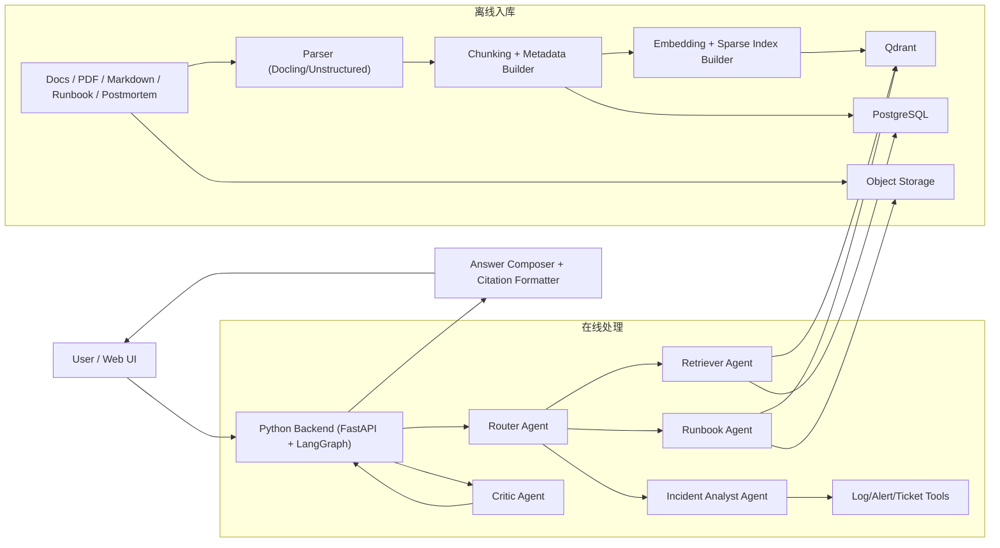
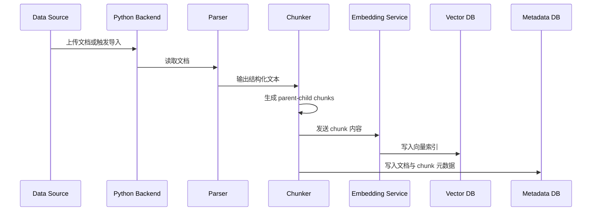
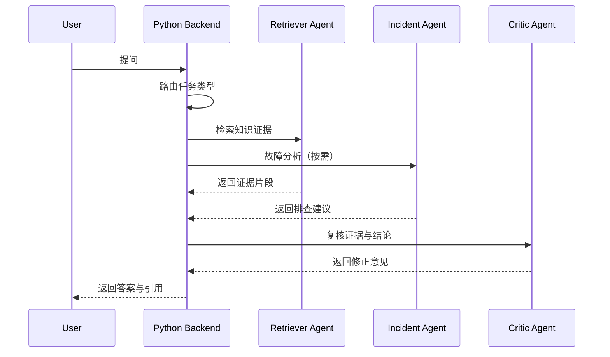

# AI Ops Knowledge Copilot Design

## 1. 设计目标

本设计面向“个人可独立完成、但足够体现 AI 应用工程深度”的目标，采用“全 Python 单后端模块化 + RAG + 多 Agent”的结构：

- Python/FastAPI 统一负责 API、用户会话、鉴权、AI 编排和外部系统集成
- LangGraph 负责 Agent 工作流编排
- 异步任务组件负责文档入库、索引重建和批量评测
- 向量库和元数据库分离，便于演示检索增强与工程化设计

## 2. 总体架构

## 3. 模块设计

### 3.1 Python Backend

职责：

- 提供统一 REST API
- 负责登录态、鉴权、会话管理
- 存储用户会话、提问记录、反馈记录
- 直接编排 AI 流程并返回前端
- 预留与工单、告警、配置中心等系统的集成能力

建议技术：

- FastAPI
- SQLAlchemy
- Alembic
- Pydantic
- Redis
- PostgreSQL

### 3.2 AI Workflow Layer

职责：

- 调度 RAG 工作流与多 Agent
- 管理 Prompt、模型调用、工具调用和重试
- 记录 tracing、token 消耗和耗时

建议技术：

- FastAPI
- LangGraph
- LangChain 或原生 SDK 封装
- Pydantic

### 3.3 Ingestion Pipeline

职责：

- 读取不同格式文档
- 解析结构化文本、标题层级、表格和页面信息
- 生成可检索 chunk 与元数据
- 写入向量库、元数据库和对象存储

关键设计：

- 对 Markdown、HTML 保留标题结构
- 对 PDF、DOCX 尽量保留段落、表格和页码
- 为每个 chunk 记录 parent_id、doc_id、section、source_url、updated_at

### 3.4 Async Jobs

职责：

- 处理耗时较长的离线任务
- 执行文档导入、索引重建、批量评测
- 支持失败重试与任务状态跟踪

建议技术：

- Celery 或 Arq
- Redis 作为 broker/queue

### 3.5 Retrieval Layer

职责：

- 查询改写
- Hybrid Retrieval
- 元数据过滤
- 重排
- 证据组装

推荐流程：

1. 用户问题标准化
2. 识别系统名、环境名、故障关键词
3. 执行 Dense Search + Sparse Search
4. 合并候选集
5. 使用 Reranker 重排
6. 返回最终证据块与父文档上下文

## 4. 数据流设计

### 4.1 离线入库流程

### 4.2 在线问答流程

## 5. RAG 设计细节

### 5.1 文档解析

推荐策略：

- Markdown：保留标题层级、代码块、表格
- PDF：提取页面、段落和表格；扫描件可作为后续增强
- Runbook/SOP：按步骤、前置条件、风险说明拆分

推荐工具：

- Docling
- Unstructured

### 5.2 Chunk 策略

采用 `parent-child chunking`：

- Parent chunk：较大上下文块，用于最终生成答案
- Child chunk：较小检索块，用于提高召回精度

建议参数：

- Child chunk：300 到 500 tokens
- Parent chunk：1000 到 1500 tokens
- Overlap：50 到 100 tokens

### 5.3 检索策略

- Dense Retrieval：基于向量相似度检索语义相关内容
- Sparse Retrieval：基于关键词/BM25 补足精确术语召回
- Metadata Filter：按系统、模块、环境、文档类型筛选
- Rerank：对召回结果重新排序

推荐组合：

- Embedding Model：可替换的文本向量模型
- Vector Store：Qdrant
- Sparse Index：Qdrant sparse 或外挂 BM25
- Reranker：轻量 cross-encoder 或 API rerank

### 5.4 生成策略

- 强制基于检索证据回答
- 输出答案时附带引用片段
- 低置信度时明确提示“仅供参考”或“证据不足”
- 支持返回“推荐进一步排查动作”

## 6. 多 Agent 设计

### 6.1 Agent 列表

#### Router Agent

职责：

- 判断属于知识问答、故障排查、Runbook 查询或影响分析
- 决定是否需要调用多个子 Agent

输入：

- 用户问题
- 会话上下文

输出：

- 任务类型
- 调用计划

#### Retriever Agent

职责：

- 问题改写
- 检索召回
- 重排
- 返回结构化证据集

输出结构示例：

- question_rewrites
- retrieved_docs
- reranked_docs
- evidence_summary

#### Incident Analyst Agent

职责：

- 从错误信息中提取症状、系统、环境、时间范围
- 结合历史事故和常见根因进行分析
- 给出排查优先级和可能根因

#### Runbook Agent

职责：

- 根据故障类型定位 SOP/Runbook
- 输出可执行排查步骤
- 提示风险操作和回滚建议

#### Critic Agent

职责：

- 检查回答是否有证据支撑
- 检查是否遗漏关键风险点
- 对高风险建议进行二次审视

### 6.2 编排模式

推荐使用“Supervisor 负责路由，子 Agent 以工具形式被调用”的模式，而不是完全自由对话式协作。这样有三个优点：

- 更容易控制流程和调试
- 更适合个人项目实现与展示
- 更容易加入 tracing 和评测

## 7. 数据模型设计

### 7.1 文档表 `documents`

字段建议：

- id
- title
- source_type
- source_uri
- doc_type
- system_name
- module_name
- environment
- owner
- version
- status
- created_at
- updated_at

### 7.2 分块表 `document_chunks`

字段建议：

- id
- doc_id
- parent_chunk_id
- chunk_level
- chunk_index
- content
- token_count
- page_no
- section_title
- metadata_json
- embedding_model
- created_at

### 7.3 会话表 `chat_sessions`

- id
- user_id
- title
- created_at
- updated_at

### 7.4 消息表 `chat_messages`

- id
- session_id
- role
- content
- answer_type
- citations_json
- trace_id
- created_at

### 7.5 评测表 `eval_cases`

- id
- question
- expected_keywords
- expected_docs
- scene_type
- created_at

## 8. API 设计

### 8.1 Unified Backend API

- `POST /api/chat`
- `GET /api/sessions/{id}`
- `POST /api/feedback`
- `POST /api/knowledge/import`
- `POST /api/knowledge/reindex`
- `POST /ai/retrieve/debug`
- `POST /ai/eval/run`
- `GET /ai/traces/{traceId}`

## 9. 可观测性设计

至少覆盖以下信息：

- 用户问题与会话 ID
- Agent 调用路径
- 每次检索的 query rewrite
- top k 召回结果
- rerank 前后排序
- 模型耗时和 token 消耗
- 错误类型与失败节点

推荐接入：

- LangSmith 或 OpenTelemetry tracing
- Prometheus + Grafana
- 结构化日志

## 10. 评测设计

评测分三层：

- 检索层：Recall@K、MRR、命中文档率
- 生成层：引用准确率、答案完整性、拒答合理性
- 场景层：故障建议可执行性、人工主观评分

评测数据集建议：

- 20 条知识问答
- 10 条故障场景
- 10 条 Runbook 推荐场景
- 5 条变更影响分析场景

## 11. 技术选型建议

### 必选

- Python 3.11 + FastAPI
- LangGraph
- SQLAlchemy + Alembic
- PostgreSQL
- Qdrant
- Redis
- Docker Compose

### 可选

- React/Next.js 前端
- MinIO 对象存储
- LangSmith
- Elasticsearch 或 OpenSearch

## 12. 部署方案

本地开发建议使用 Docker Compose 启动以下服务：

- backend
- worker
- postgres
- redis
- qdrant
- minio

后续可平滑迁移到云上容器平台。

## 13. 风险与权衡

- 多 Agent 过多会增加复杂度，首版应控制在 3 到 4 个核心 Agent
- 数据源质量直接决定 RAG 效果，应优先整理高质量文档样本
- 没有真实日志/工单系统时，可用模拟数据先打通流程
- 首版不追求复杂权限体系，优先完成检索质量和场景闭环
